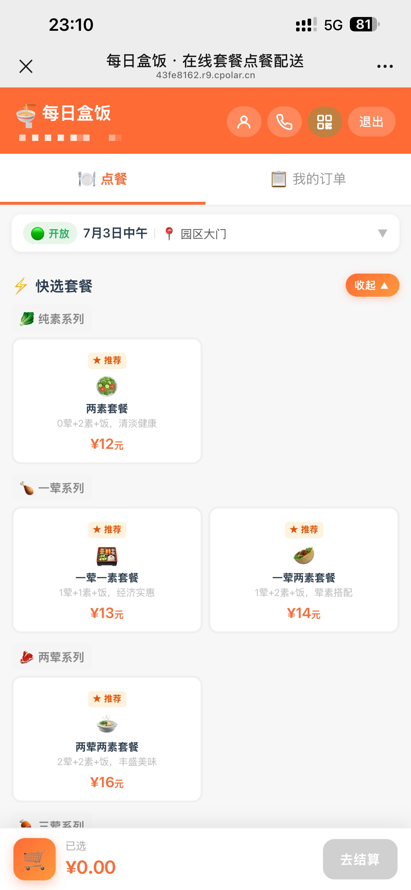
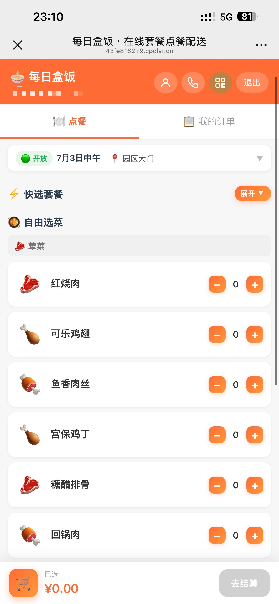
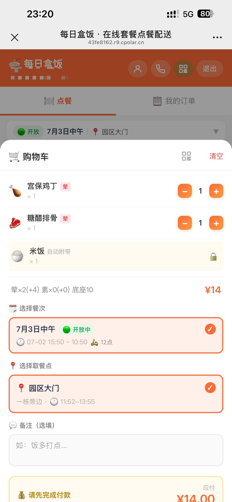
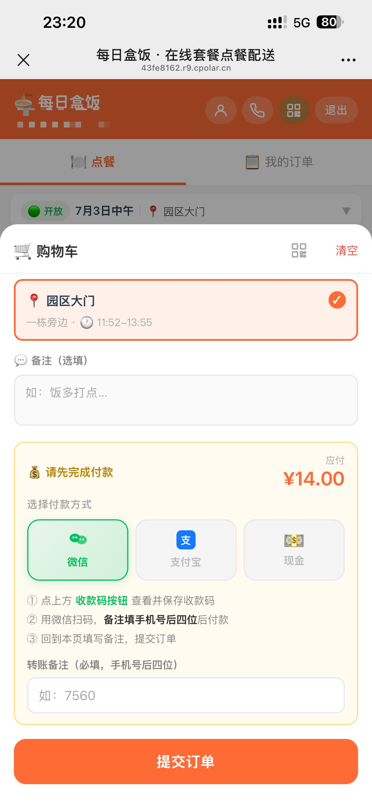
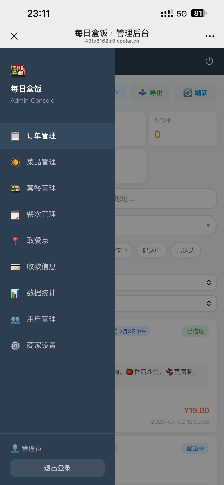
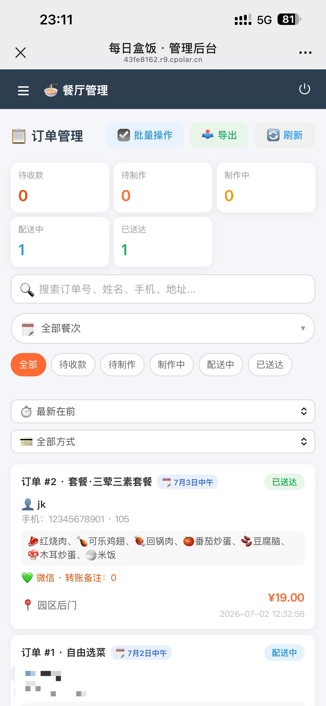
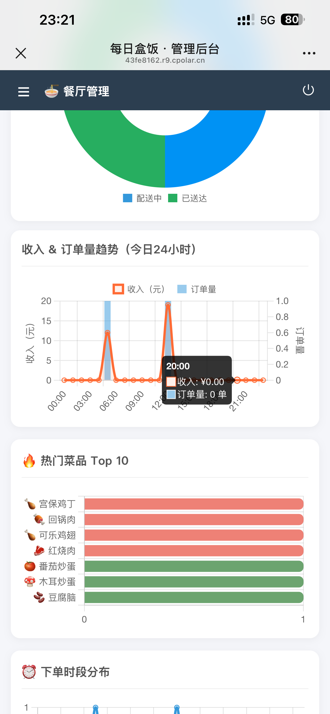

# 每日盒饭 · 在线套餐点餐配送


基于 Flask + SQLite 的轻量级在线套餐点餐配送系统，支持用户点餐和管理员后台，提供套餐随机搭配与自由点菜两种下单方式。开箱即用，无需额外数据库服务，手机电脑均可访问。

---

## 界面截图

| | |
|:---:|:---:|
|  |  |
|  |  |
|  |  |
|  |  |

---

## 适用场景

本系统设计为通用点餐平台，凡是需要"提前下单、集中配送/取餐、扫码付款"的场景均适用：

| 场景 | 说明 |
|------|------|
| 🏫 学校食堂 / 班级团餐 | 学生提前选餐，按班级或取餐点统一配送，管理员批量处理订单 |
| 🏢 企业内部订餐 | 员工选择当日套餐，按部门或楼层取餐，财务统一结算 |
| 🏘️ 社区 / 小区团餐 | 居民预订，按楼栋配送，适合养老助餐、社区食堂等场景 |
| 🏋️ 健身房 / 培训机构 | 学员课间订餐，指定取餐点，减少排队等待 |
| 🎪 活动 / 展会餐饮 | 限时开放点餐，通过餐次控制下单时间窗口，避免拥挤 |
| 🍱 外卖自提点 | 支持多取餐点配置，顾客选点自提，商家按点备餐 |
| 🍽️ 小型餐厅堂食 | 顾客扫码点餐，厨房接单制作，无需纸质菜单 |

**核心优势：**
- 套餐 + 自由选菜双模式，既可快速下单也可个性化搭配
- 餐次机制控制下单时间窗口，适合有固定用餐时间的场景
- 多取餐点支持，一个系统管理多个配送/自取位置
- 扫码付款 + 转账备注核销，无需对接支付 API
- 纯静态前端 + 单文件后端，部署门槛极低

---

## 快速启动

**方式一：一键启动（Windows 推荐）**

双击项目根目录下的 `start.bat`，自动进入 `backend/` 并启动 Flask 服务。

**方式二：手动启动**

```bash
cd backend
pip install -r requirements.txt
python app.py
```

启动后访问：

| 页面 | 地址 |
|------|------|
| 用户点餐端 | http://localhost:5001 |
| 管理后台 | http://localhost:5001/admin |
| 手机访问（同 WiFi）| http://本机局域网IP:5001 |

> 启动日志会自动打印局域网 IP，手机与电脑连同一 WiFi 即可访问。

---

## 默认账号

| 角色 | 账号 | 密码 |
|------|------|------|
| 管理员 | admin | admin123 |
| 用户 | 注册时自行创建 | — |

> 生产环境请在 `config.py` 中修改 `SECRET_KEY`。

---

## 功能说明

### 用户端

- 手机号 + 密码注册登录，JWT Token 鉴权（有效期 30 天，支持记住密码）
- 实时展示当前餐次状态（名称、开放/截止时间、配送时间）和全部取餐点
- 套餐点单：选择套餐类型，系统自动随机搭配荤素菜品；推荐套餐默认展示，其余折叠
- 自由点餐：自选菜品和数量，按公式计价（`10 + 荤数×2 + 素数×1`，含饭）
- 支持预约：可选当前开放餐次或即将开放的未来餐次
- 取餐点下拉选择，也可手动填写送餐地址
- 购物车展示收款码（微信/支付宝）、应付金额，填写转账备注后提交
- 个人订单历史查询（含餐次、取餐点、支付状态）
- 个人资料页可修改姓名、备注信息和密码

### 管理员端

- 订单管理：按餐次/状态/关键词筛选，实时统计各状态数量
- 批量操作：批量确认收款、接单、配送、送达
- 状态流转：`待收款 → 待制作 → 制作中 → 配送中 → 已送达`
- 餐次管理：创建餐次，设置开放时间段（控制用户能否下单）
- 菜单管理：添加/编辑菜品，上下架控制
- 套餐管理：新增/编辑套餐，标记推荐套餐，自动计算推荐价格
- 取餐点管理：增删改查，启用/禁用控制
- 收款码配置：上传微信/支付宝收款码图片（Base64 存数据库，全设备共享）
- 用户管理：查看注册用户，支持搜索，可删除用户及其订单
- 统计分析：订单量、收入趋势、热门菜品、套餐/支付渠道/取餐点分布等

---

## 点餐开关机制

用户能否下单完全由**餐次**控制：

- 管理员创建餐次并设置 `order_start ~ order_end` 时间段
- 当前时间在此范围内 → 点餐开放；超出范围 → 用户端显示锁定提示
- 支持预约：餐次尚未开始时，用户可提前锁定餐次（到时间自动生效）

---

## 套餐规则

计价公式：`总价 = 10 + 荤菜数 × 2 + 素菜数 × 1`（底座 8 元 + 米饭 2 元）

| 套餐示例 | 荤 | 素 | 价格 |
|---------|----|----|------|
| 一素套餐 | 0 | 1 | ¥11 |
| 一荤一素套餐 | 1 | 1 | ¥13 |
| 两荤两素套餐 | 2 | 2 | ¥16 |
| 三荤三素套餐 | 3 | 3 | ¥19 |

共 12 种套餐（0~3 荤 × 1~3 素的组合），菜品由系统从可用菜单中**随机抽取**，每单附带 1 份米饭。

管理员可将常用套餐标记为"推荐"，用户端默认只展示推荐套餐，点"查看更多"展开全部。建议设置 3~6 个推荐套餐。

---

## 初始菜品数据

首次启动自动写入：

- **荤菜（6 种）**：红烧肉、可乐鸡翅、鱼香肉丝、宫保鸡丁、糖醋排骨、回锅肉
- **素菜（6 种）**：炒青菜、土豆丝、番茄炒蛋、豆腐脑、清炒藕片、木耳炒蛋
- **主食**：米饭（每单自动附带）

> 管理员可在后台随时增删改菜品，初始数据只在首次启动时写入。

---

## API 接口

> 鉴权接口请在 Header 携带：`Authorization: Bearer <token>`

### 认证

| 方法 | 路径 | 说明 |
|------|------|------|
| POST | `/api/auth/register` | 注册（name, phone, password, class_name 可选）|
| POST | `/api/auth/login` | 登录（phone, password）|
| GET  | `/api/auth/me` | 获取当前用户信息 |
| PUT  | `/api/auth/me` | 修改姓名/备注/密码 |
| POST | `/api/admin/login` | 管理员登录（username, password）|

### 菜单（公开）

| 方法 | 路径 | 说明 |
|------|------|------|
| GET | `/api/menu` | 获取可用菜品列表 |
| GET | `/api/menu/combos` | 获取套餐类型列表 |
| GET | `/api/menu/pickup` | 获取启用的取餐点列表 |
| GET | `/api/menu/session` | 获取当前餐次状态 |
| GET | `/api/menu/qrcode` | 获取收款码（无需登录）|

### 订单（需用户 Token）

| 方法 | 路径 | 说明 |
|------|------|------|
| POST | `/api/orders` | 提交订单 |
| GET  | `/api/orders/my` | 获取我的订单列表 |

### 管理员（需管理员 Token）

| 方法 | 路径 | 说明 |
|------|------|------|
| GET  | `/api/admin/orders` | 订单列表（?status= ?session_id= ?q=）|
| PUT  | `/api/admin/orders/<id>/status` | 更新订单状态 |
| POST | `/api/admin/orders/<id>/confirm_payment` | 确认收款 |
| GET/POST | `/api/admin/menu` | 菜品列表 / 新增菜品 |
| PUT/DELETE | `/api/admin/menu/<id>` | 编辑 / 下架菜品 |
| GET/POST | `/api/admin/combos` | 套餐列表 / 新增套餐 |
| GET  | `/api/admin/combos/calc-price` | 计算推荐价格（?meat= ?veg=）|
| PUT/DELETE | `/api/admin/combos/<id>` | 编辑 / 删除套餐 |
| POST | `/api/admin/combos/<id>/featured` | 切换套餐推荐状态 |
| GET/POST | `/api/admin/pickup` | 取餐点列表 / 新增 |
| PUT/DELETE | `/api/admin/pickup/<id>` | 编辑 / 删除取餐点 |
| GET/POST | `/api/admin/sessions` | 餐次列表 / 创建餐次 |
| PUT/DELETE | `/api/admin/sessions/<id>` | 编辑 / 删除餐次 |
| GET/PUT/DELETE | `/api/admin/qrcode/<type>` | 收款码管理（wechat/alipay）|
| PUT  | `/api/admin/qrcode/<type>/url` | 保存收款链接 |
| GET/PUT | `/api/admin/contact` | 商家联系方式 |
| GET  | `/api/admin/users` | 用户列表（?q= 搜索）|
| DELETE | `/api/admin/users/<id>` | 删除用户及其订单 |
| GET  | `/api/admin/stats` | 统计分析（?range=today\|week\|month\|all&session_id=）|

---

## 项目结构

```
order_dishes/
├── backend/
│   ├── app.py              # Flask 主程序，注册蓝图、初始化 DB、自动补列
│   ├── models.py           # 数据模型（User/Admin/MenuItem/ComboType/PickupPoint/OrderSession/Order/OrderItem/SystemConfig）
│   ├── config.py           # JWT 密钥配置
│   ├── utils.py            # JWT 鉴权装饰器（student_required / admin_required）
│   ├── seed.py             # 初始数据（管理员账号 + 12 种套餐 + 菜品 + 米饭）
│   ├── food_order.db       # SQLite 数据库（自动生成，已加入 .gitignore）
│   ├── requirements.txt    # Python 依赖
│   └── routes/
│       ├── auth.py         # 注册 / 登录 / 个人信息
│       ├── menu.py         # 菜单、套餐、取餐点、餐次、收款码（公开）
│       ├── orders.py       # 用户下单 / 查订单
│       ├── admin.py        # 管理员全部接口
│       └── stats.py        # 统计分析（/api/admin/stats）
├── frontend/
│   └── index.html          # 用户点餐端（单页应用，无框架）
├── admin/
│   └── index.html          # 管理后台（单页应用，无框架）
├── docs/                   # 设计文档
├── start.bat               # Windows 一键启动脚本
└── README.md
```

---

## 技术栈

| 层 | 技术 |
|----|------|
| 后端框架 | Flask 3.0 |
| ORM / 数据库 | Flask-SQLAlchemy 3.1 + SQLAlchemy 2.0 + SQLite |
| 认证 | PyJWT 2.8（HS256，30 天有效期）|
| 跨域 | Flask-CORS 4.0 |
| 密码加密 | Werkzeug 3.0（pbkdf2:sha256）|
| 前端 | 原生 HTML / CSS / JavaScript（无框架依赖）|

---

## 依赖清单

```
Flask==3.0.3
Flask-SQLAlchemy==3.1.1
Flask-CORS==4.0.1
PyJWT==2.8.0
Werkzeug==3.0.3
SQLAlchemy==2.0.36
```

---

## 注意事项

- `food_order.db` 首次启动时自动创建，建议加入 `.gitignore` 不提交到版本库
- 旧版数据库缺少新字段时，`app.py` 会自动执行 `ALTER TABLE` 补列，无需手动迁移
- 服务端口默认 **5001**，如需修改请同时更新 `app.py` 和前端 `const API` 地址
- 收款码以 Base64 存入 `system_config` 表，所有设备共享，本地也会缓存到 `localStorage`
- 支付流程：用户下单 → 填写转账备注（手机号后四位）→ 扫码付款 → 管理员核对后点"确认收款" → 进入制作流程
- 注册字段中的"备注"（数据库字段 `class_name`）为选填，可用于记录部门、楼栋或其他自定义信息
